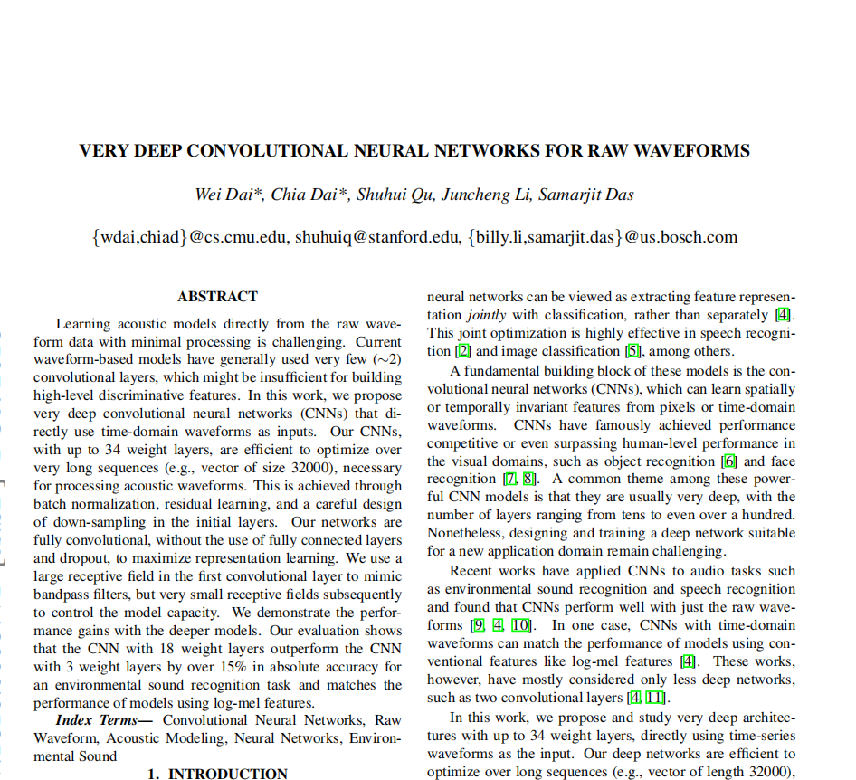

# CNN-for-Raw-Waveforms
This is my attempt to implement the "Very Deep Convolutional Neural Networks For
Raw Waveforms" research paper published in 2016. My implementation has been
done fully using PyTorch and PyTorchAudio.

The aim of this paper is to process raw audio wav files using only Convolution
networks. The paper proposes five different models that range from 3 layers to
34 layers. The dataset used in this paper named "Urban Sound 8K" which contains
short audio files (1-4 seconds) of 44,100 HZ stereo wav files.

<div align="Center">
    <a href="https://arxiv.org/pdf/1610.00087.pdf">  </a>
</div>


## Notebooks

In this repo, you can find notebooks for both GoogleColab and Kaggle that can
be used directly without the need to clone the repo or anything. These files
can be found in the `notebooks` directory.


# Pre-requisites

To install the dependencies for this project, you need to run the following command:

```
pip install -r requirements.txt
```
# Data

The dataset used in this paper is [Urban Sound 8K](https://www.kaggle.com/chrisfilo/urbansound8k). You can download the dataset simply by following these steps:

1. Create an account on [Kaggle](https://kaggle.com/) if you haven't already.

2. Go to your account and create a new token.

<div align="Center">
    
</div>


3. This will directly download a JSON file called `kaggle.json`. Create a `.kaggle` directory in your home directory and copy this file to `~/.kaggle`. This can
be done using the following commands:
    ```
    mkdir -p ~/.kaggle
    cp kaggle.json ~/.kaggle
    chmod 600 ~/.kaggle/kaggle.json
    ```

4. Now, get to the `urbansound8k` directory and run the bash script:

    ```
    cd urbansound8k
    bash download_dataset.sh 
    ```

# Models

As we said earlier, the paper proposes five different models that range from 3 layers to 34 layers. These five models are defined in the `models.py` script like so:

```python
m3 = CNN(channels = [[256], [256]],
         conv_kernels = [80, 3],
         conv_strides = [4, 1],
         conv_padding = [38, 1],
         pool_padding = [0, 0])

m5 = CNN(channels = [[128], [128], [256], [512]],
         conv_kernels = [80, 3, 3, 3],
         conv_strides = [4, 1, 1, 1],
         conv_padding = [38, 1, 1, 1],
         pool_padding = [0, 0, 0, 2])

m11 = CNN(channels = [[64], [64]*2, [128]*2, [256]*3, [512]*2],
          conv_kernels = [80, 3, 3, 3, 3],
          conv_strides = [4, 1, 1, 1, 1],
          conv_padding = [38, 1, 1, 1, 1],
          pool_padding = [0, 0, 0, 2])

m18 = CNN(channels = [[64], [64]*4, [128]*4, [256]*4, [512]*4],
          conv_kernels = [80, 3, 3, 3, 3],
          conv_strides = [4, 1, 1, 1, 1],
          conv_padding = [38, 1, 1, 1, 1],
          pool_padding = [0, 0, 0, 2])

m34_res = CNNRes(channels = [[48], [48]*3, [96]*4, [192]*6, [384]*3],
          conv_kernels = [80, 3, 3, 3, 3],
          conv_strides = [4, 1, 1, 1, 1],
          conv_padding = [38, 1, 1, 1, 1],
          pool_padding = [0, 0, 0, 2])
```
When you dig a little bit deeper in this script, you will see that there are
two main base classes which are `CNN` and `CNNRes`. The first class is used with
the first four models in the paper. The second class is the same as the first one
but with residual blocks instead.

# Experiments

In this `experiments.py` script you can replicate all the experiments found in
the paper. You can try any experiment like the following one:
```
python experiments.py --model M34_res --n 5 --shuffle true --seed 42 --batchSize 128 --dataPath "urbansound8k"
```

# Inference

TODO